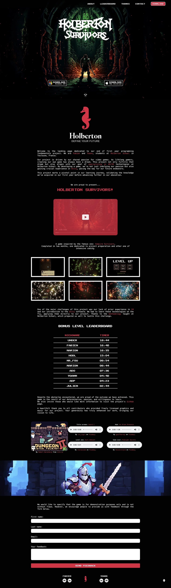
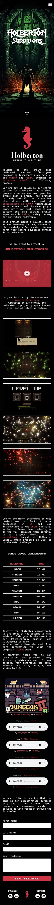

# Holberton Survivors Landing Page

## Description

Holberton Survivors Landing Page is a promotional website for our end-of-first-year project at Holberton School: [Holberton Survivors](https://github.com/fchavonet/unity-2d-holberton_survivors), a 2D survival game inspired by Vampire Survivors.

Developed by me and [Yoann Rivet](https://github.com/SpStigma), this page showcases the project, offers download links for both Windows and Mac, presents a special leaderboard for a challenge mode, and collects user feedback.

It's designed to highlight our technical and creative journey while making the game easily accessible to players and reviewers alike.

## Objectives

- Promote the Holberton Survivors game with a clean, interactive landing page.
- Provide direct download links for both Windows and Mac versions.
- Explain the context, goals, and development process of the game.
- Integrate a real-time leaderboard for a special challenge mode.
- Enable players to share feedback through a contact form.
- Serve as a bridge between our technical project and its audience.

## Tech Stack


## File Description

| **FILE**         | **DESCRIPTION**                                     |
| :--------------: | --------------------------------------------------- |
| `assets`         | Contains the resources required for the repository. |
| `index.html`     | Main HTML structure for the project.                |
| `style.css`      | Styles and animations for the project.              |
| `script.js`      | Behavior script for interactivity.                  |
| `particles.js`   | JavaScript library for generating particle effects. |
| `send_email.php` | PHP script to send emails from the contact form.    |
| `favicon.ico`    | Website icon displayed in browser tabs.             |
| `.gitignore`     | Specifies files and folders to be ignored by Git.   |
| `README.md`      | The README file you are currently reading 😉.       |

## Installation & Usage

### Installation

1. Clone this repository:
    - Open your preferred Terminal.
    - Navigate to the directory where you want to clone the repository.
    - Run the following command:

```
git clone https://github.com/fchavonet/full_stack-holberton_survivors_landing_page.git
```

2. Open the cloned repository.

### Usage

1. Open the `index.html` file in your web browser.

> 📌 The contact form (email sending) will only work when hosted on a server with PHP support.

You can also test the project online by clicking [here](https://www.holbertonsurvivors.com/). 

<table>
    <tr>
        <th align="center" style="text-align: center;">Desktop view</th>
        <th align="center" style="text-align: center;">Mobile view</th>
    </tr>
    <tr valign="top">
        <td align="center">
            
        </td>
        <td align="center">
            
        </td>
    </tr>
</table>

## What's Next?

- Restore the parallax effect on the logo in the download section.
- Add animations to the screenshot gallery for a more dynamic experience.
- Clean and refactor the codebase.

## Thanks

- A big thank you to my friends Pierre and Yoann, always available to test and provide feedback on my projects.

## Author(s)

**Fabien CHAVONET**
- GitHub: [@fchavonet](https://github.com/fchavonet)
